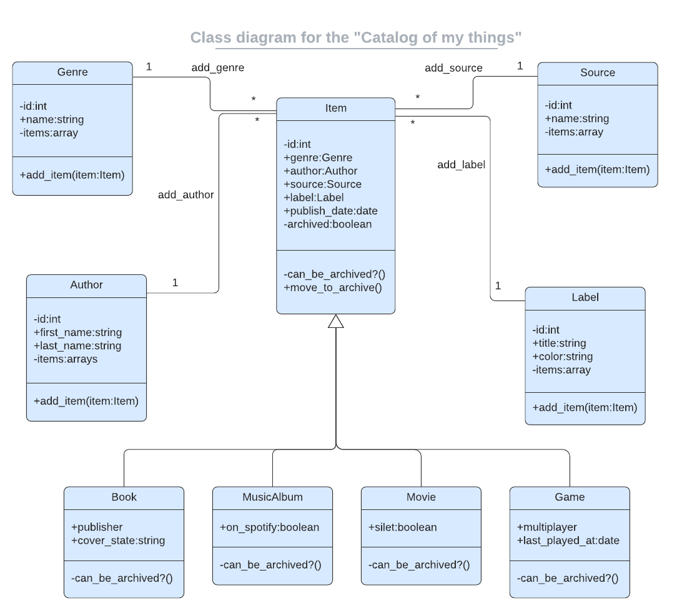

<a name="readme-top"></a>
<h1>CATALOG OF MY THINGS</h1>

# 📗 Table of Contents

- [📖 About the Project](#about-project)
  - [🛠 Built With](#built-with)
    - [Tech Stack](#tech-stack)
    - [Key Features](#key-features)
- [💻 Getting Started](#getting-started)
  - [Prerequisites](#prerequisites)
  - [Setup](#setup)
  - [Install](#install)
  - [Usage](#usage)
  - [Run tests](#run-tests)
- [👥 Authors](#authors)
- [🔭 Future Features](#future-features)
- [🤝 Contributing](#contributing)
- [⭐️ Show your support](#support)
- [🙏 Acknowledgements](#acknowledgements)
- [📝 License](#license)


# 📖 [Catalog Of My Things] <a name="about-project"></a>

> **Catalog Of My Things** is an app that will help user to keep a record of different types of things they own: books, music albums, and games. The data is stored in JSON files. There is also a database with tables structure analogical to program's class structure. *Everything will be based on the UML class diagram presented below.*


## 🛠 Built With <a name="built-with"></a>
> This project is built with Ruby.

### Tech Stack <a name="tech-stack"></a>
> <details>
> <summary>Database</summary>
  <ul>
    <li><a href="https://www.postgresql.org/">PostgreSQL</a></li>
  </ul>
</details>

> <details>
>  <summary>Ruby</summary>
  <ul>
    <li><a href="https://www.ruby-lang.org/en/">Ruby - A Programmer's Best Friend</a></li>
  </ul>
</details>

### Key Features <a name="key-features"></a>

> - **Logic**
>   - Implementation of class: Item, Book, Label MusicAlbum, Genre, Game, and Author
>   - Implementation of associations (1-to-many relationships) and aggregations (parent-child relationships) between classes
>   - Implementation of methods: add_item, can_be_archived?, and move_to_archive
>   - Unit tests for all implemented methods

> - **User Interface**
>   - Has a console app that
>      - Present the user with a list of options to perform
>      - Let users choose an option
>      - If needed, ask for parameters for the option
>      - Have a way to quit the app
>   - The following options are available:
>      - List all books
>      - List all music albums
>      - List all movies
>      - List of games
>      - List all genres (e.g 'Comedy', 'Thriller')
>      - List all labels (e.g. 'Gift', 'New')
>      - List all authors (e.g. 'Stephen King')
>      - List all sources (e.g. 'From a friend', 'Online shop')
>      - Add a book
>      - Add a music album
>      - Add a movie
>      - Add a game
>   - All data are preserved by saving collections in .json files

> - **Database**
>   - Has tables that is analogical to the structure of classes in the app

<p align="right">(<a href="#readme-top">back to top</a>)</p>

<!-- GETTING STARTED -->

## 💻 Getting Started <a name="getting-started"></a>

> This repository includes files with plain SQL that can be used to recreate a database:

> - Use [schema.sql](./schema.sql) to create all tables.

### Prerequisites

> In order to run this project you need:
> - Download and Install [Ruby](https://www.ruby-lang.org/en/downloads/) for your OS.
> - Download and Install [PostgreSQL](https://www.postgresql.org/download/)
> - VS Code

### Setup

Clone this repository to your desired folder:<br>
  ```sh
  git clone https://github.com/anita00001/Catalog-of-my-things.git
```
```sh
cd Catalog-of-my-things
```
```sh
psql
```

### Install

> Install this project with:

```sh
  gem install
```

```sh
  bundle install
```

### Usage

> To run the project, execute the following command:
```sh
  ruby main.rb
```

### Run tests

> To run linters check, run the following command:

```sh
  gem install rubocop
```

```sh
  rubocop
```

## 👥 Authors <a name="authors"></a>

👤 **Anita Sharma**

> - GitHub: [@anita00001](https://github.com/anita00001)
> - LinkedIn: [anitaa-sharmaa](https://www.linkedin.com/in/anitaa-sharmaa/)
> - Twitter: [@anitaa_sharmaa](https://twitter.com/anitaa_sharmaa)

👤 **Author2**

- GitHub: [@mosidrum](https://github.com/mosidrum)
- Twitter: [@mosidrum](https://twitter.com/mosidrum)
- LinkedIn: [@mosidrum](https://linkedin.com/in/mosidrum/)

<p align="right">(<a href="#readme-top">back to top</a>)</p>

## 🔭 Future Features <a name="future-features"></a>

> - **Add more item in my Catalog (eg: Movie)**
> - **Add additional methods like: remove a selected book**
> - **Add additional methods like: sort music by genre**

<p align="right">(<a href="#readme-top">back to top</a>)</p>

## 🤝 Contributing <a name="contributing"></a>

> Contributions, issues, and feature requests are welcome!

> Feel free to check the [issues page](https://github.com/anita00001/Catalog-of-my-things/issues).

<p align="right">(<a href="#readme-top">back to top</a>)</p>


## ⭐️ Show your support <a name="support"></a>

> If you like this project, you can appreciate us by giving star ⭐

<p align="right">(<a href="#readme-top">back to top</a>)</p>

## 🙏 Acknowledgments <a name="acknowledgements"></a>

> We would like to thank Microverse for providing this opportunity to build this project. Also, we extend my sincere gratitute to Code Reviewers who encourage and support to build this application more effieiently.

<p align="right">(<a href="#readme-top">back to top</a>)</p>

## 📝 License <a name="license"></a>

This project is [MIT](./MIT.md) licensed.

<p align="right">(<a href="#readme-top">back to top</a>)</p>
